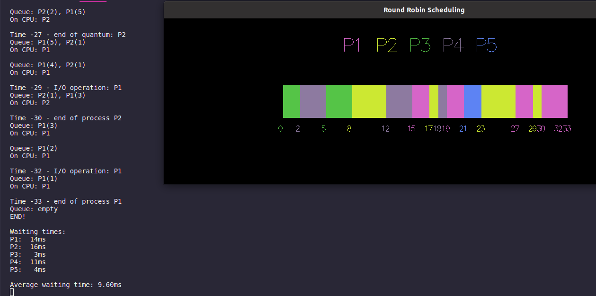
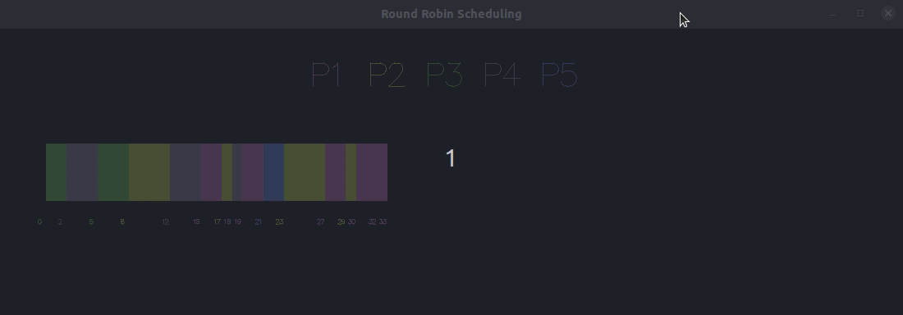

<p align="center">
  

  
  
  <a href="https://github.com/WebisD/http-api-without-lib/commits/master">
    
  </a>
  
   
</p>
<!-- PROJECT LOGO -->
<br />
<p align="center">
  <a href="https://github.com/WebisD/http-api-without-lib">
    
  </a>

  <h3 align="center">Round Robin Scheduling</h3>

  <p align="center">
    A round robin simulation with visualization in opengl
  </p>
</p>

<p align="center">
    
    
</p>


<!-- TABLE OF CONTENTS -->
<details open="open">
  <summary>Table of Contents</summary>
  <ol>
    <li>
      <a href="#-about-the-project">About The Project</a>
    </li>
    <li>
      <a href="#-how-to-run">How To Run</a>
    </li>
    <li>
      <a href="#-visualization">Visualization</a>
    </li>
  </ol>
</details>


<!-- ABOUT THE PROJECT -->
## ℹ️ About The Project
In this project, we implemented the round robin scheduling algorithm that "slices" the process for better perfomance at the CPU. 

We also provide a visualization of the CPU and how the process are arrenged in [OpenGL](https://www.opengl.org//)




<!-- HOW TO RUN -->
## 🚀 How To Run

### Just in terminal

* You have to comment the first line of **main.c** for this to work

```bash

# Clone the repository
$ git clone https://github.com/WebisD/round-robin-scheduling.git

# Access the project folder in your terminal / cmd
$ cd round-robin-scheduling

# Compile the application
$ gcc -o main main.c

# Run the application
$ ./main

```

### With opengl visualization

```bash

# Clone the repository
$ git clone https://github.com/WebisD/round-robin-scheduling.git

# Access the project folder in your terminal / cmd
$ cd round-robin-scheduling

# Install dependencies for opengl
$ sudo apt-get install freeglut3 freeglut3-dev mesa-common-dev

# Compile the application
$ gcc -o main main.c -lglut -lGL -lGLU

# Run the application
$ ./main

```


<!-- Visualization -->
## 💻 Visualization



### Zoom in and zoom out

> Use the up arrow `↑` in your keyboard to zoom in

> Use the down arrow `↓` in your keyboard to zoom out

### Scrolling

> Use the scroll wheel of your mouse to move the cpu for better view

